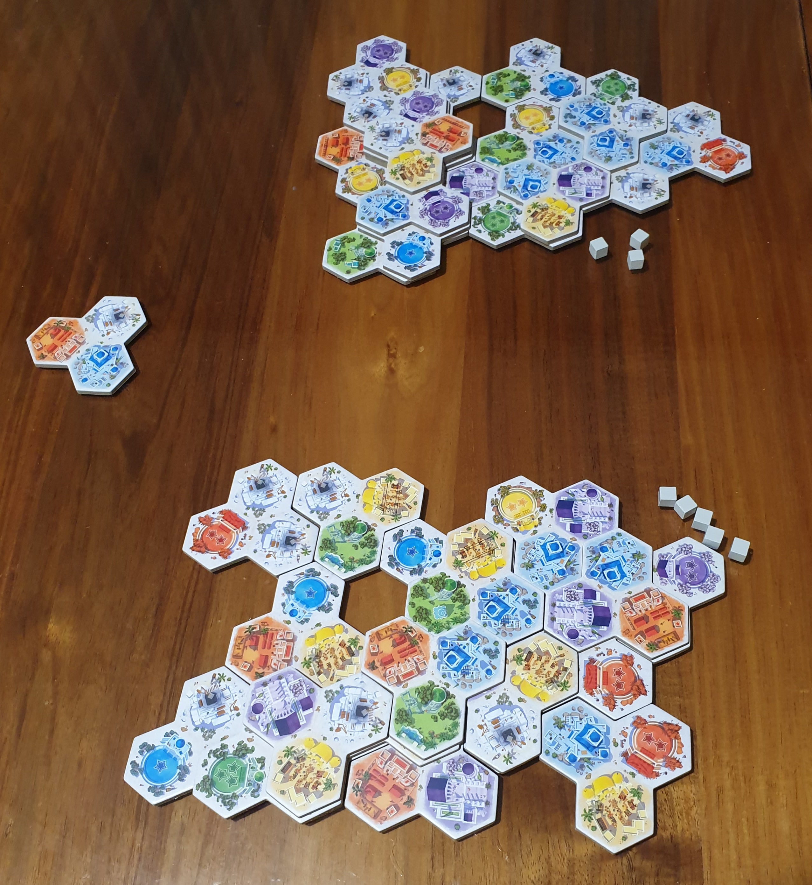
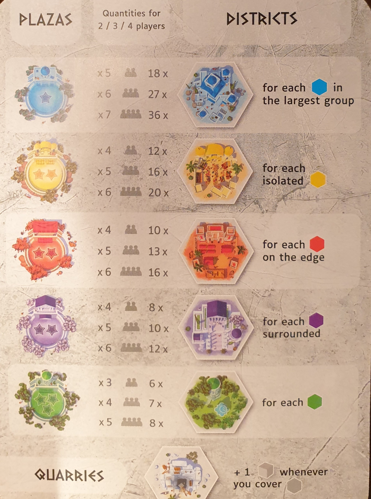
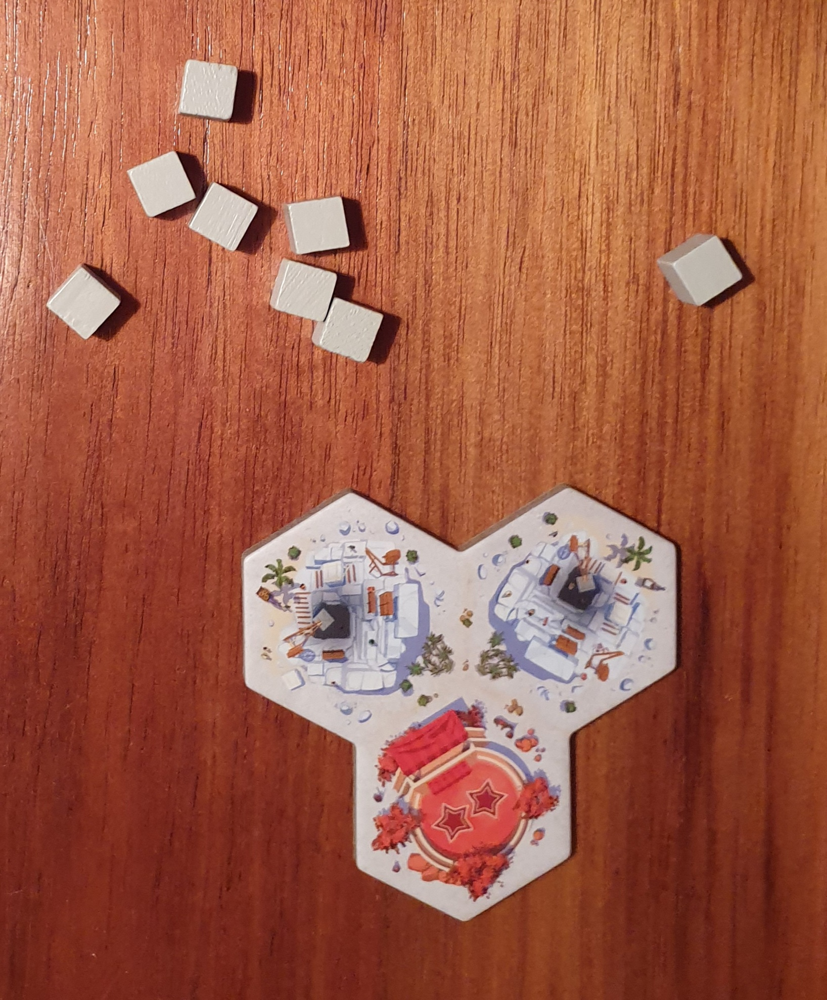
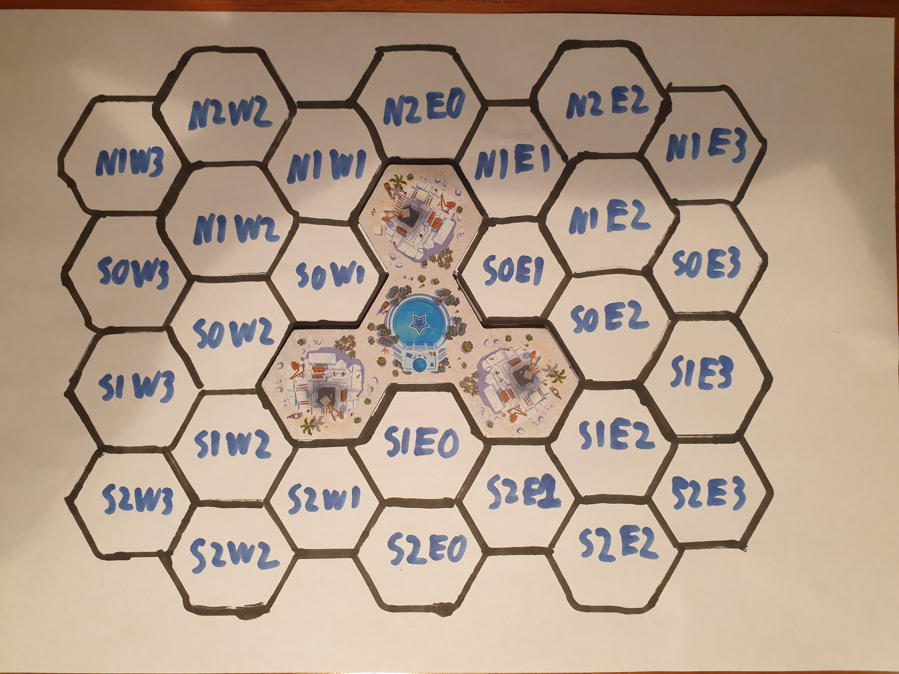
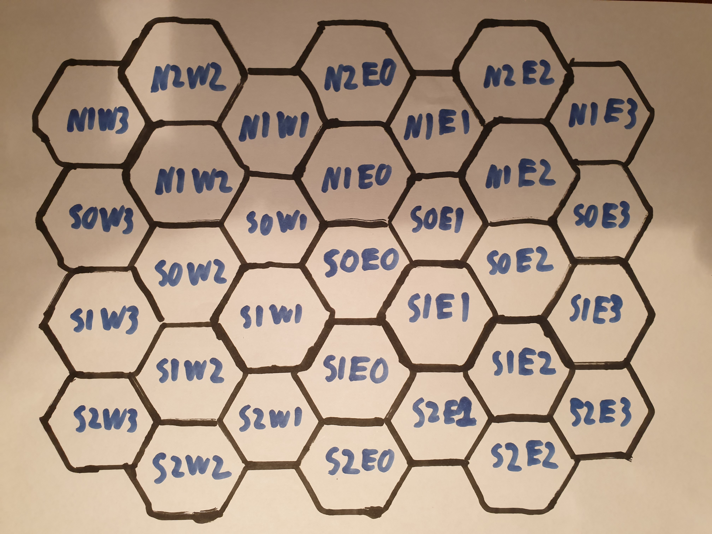
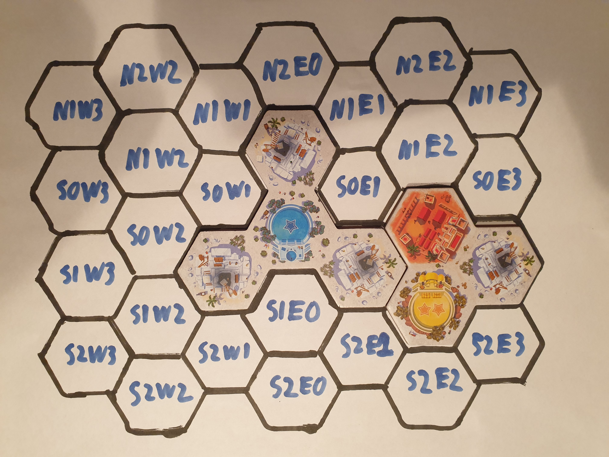
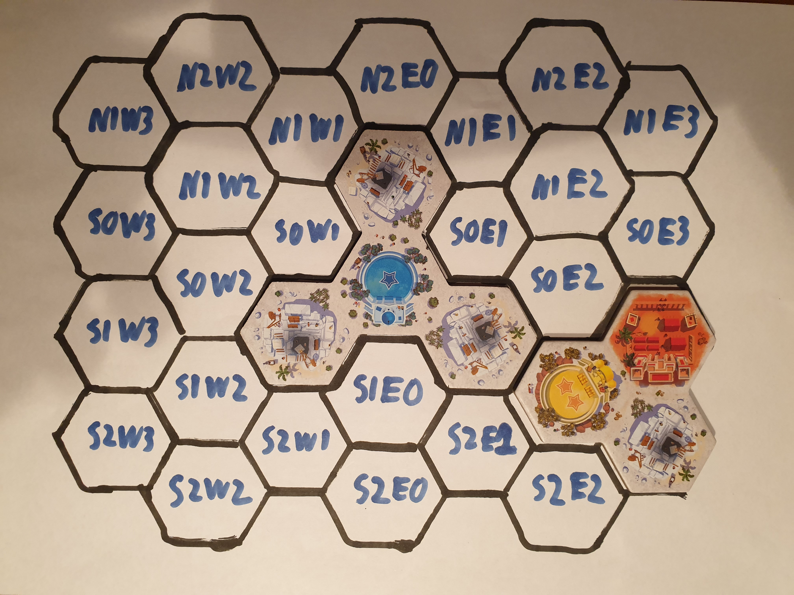
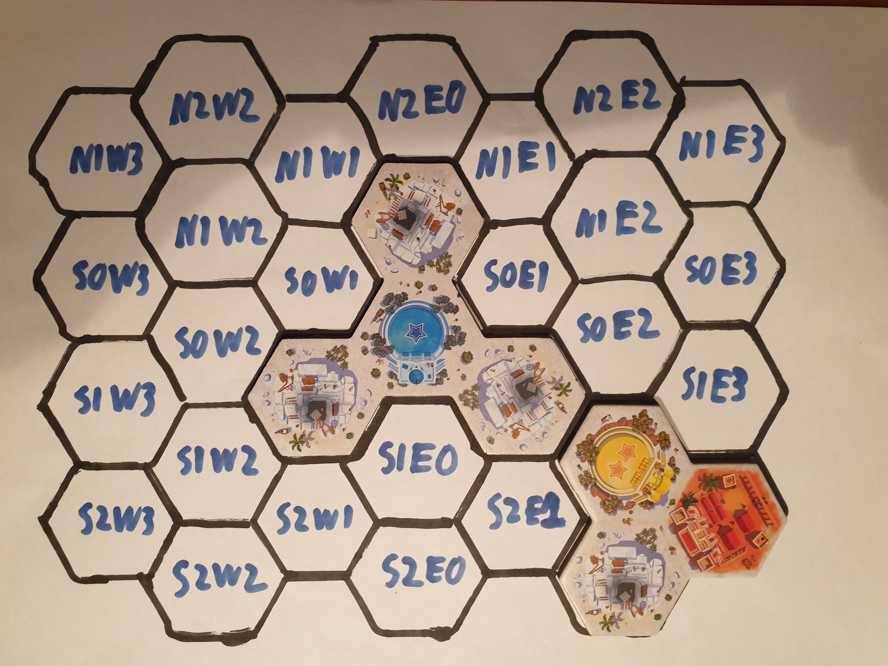
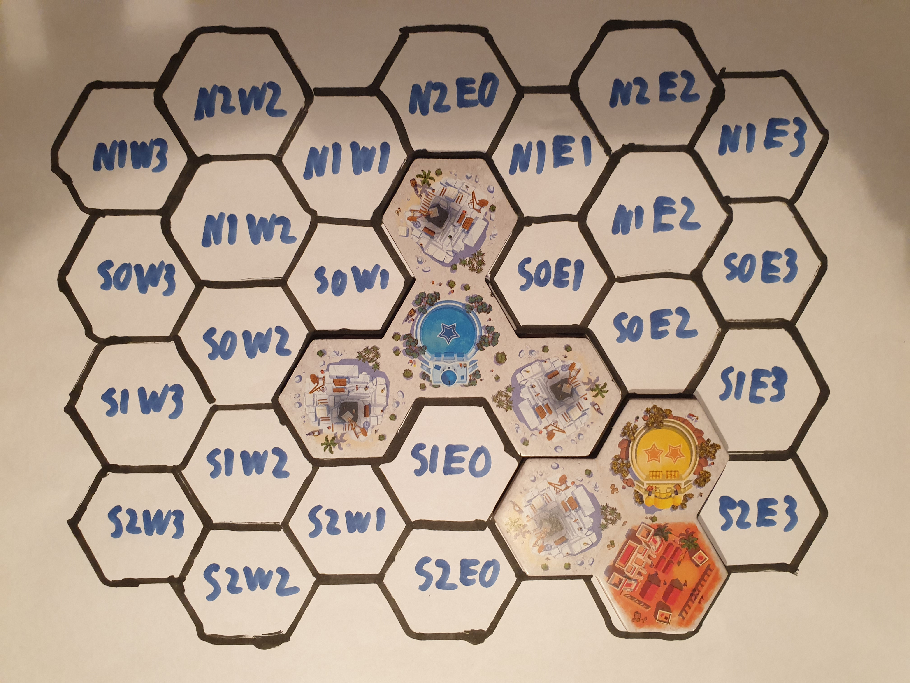
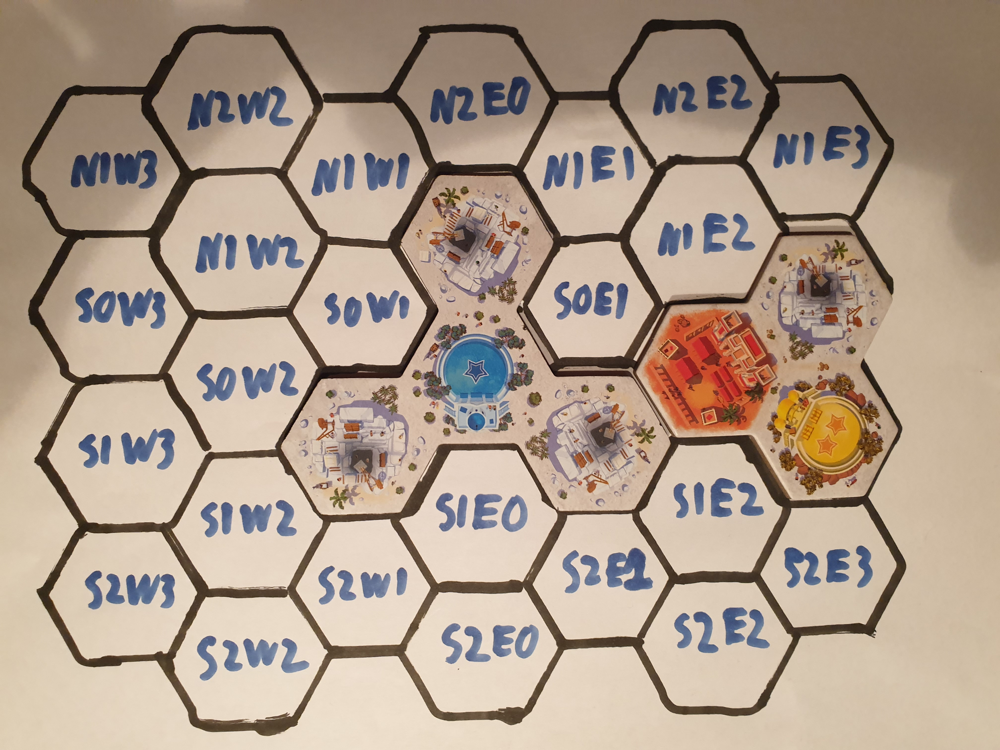

# Akropolis Project
This project is based on work I did for an ANU course.

## Problem Description

Your task is to implement in Java, using JavaFX, a board game
called [Akropolis](https://www.hachetteboardgames.com/products/akropolis),
made by Jules Messaud and Pauline D'Étraz, and published by games developer [Gigamic](https://en.gigamic.com/).
[BoardGameGeek](https://boardgamegeek.com/boardgame/357563/akropolis) provides an overview of the game, including
pictures.

## Game Rules

Akropolis is a two to four player game in which each player (or architect) tries to build
the highest-scoring city in ancient Greece.
Players take turns taking tiles from a collection of available tiles, which they then add to their
city. Points are awarded via numerous mechanisms, all of which encourage players to plan their
city carefully and place *Districts* in advantageous areas.

The game ends when there is only one tile remaining in the *Construction Site* (supply). The winner
is the player with the highest score. In the case of a draw, the player with the most *stones* wins.

There is a great video walkthrough of this game on YouTube by
[Meeple University](https://www.youtube.com/watch?v=e73LgPhD0z4), however, please make sure you also
read this document in its entirety.

We have also provided you with the [official rules](assets/rules.pdf). We recommend consulting the official rules if
you need further clarity, however, all the game rules will also be sufficiently explained in this readme.
There is no difference between the official rules and rules used in this assignment.

The image below shows an example game of a finished game of Akropolis between
two players. The Construction Site appears on the left of the photo -
importantly the last tile is never played. The stones each player has appears
as the grey cubes next to their boards.

Also note that tiles can be placed on top of other tiles. This, and rules around placing tiles in general,
will be discussed in more detail later in this readme.

### Plazas and Districts

Each hexagon of a specific colour (without stars) corresponds to an important element of an ancient Greek city.
*Blue* tiles correspond to **Houses**, *yellow* tiles correspond to **Markets**, *red* tiles
correspond to **Barracks**, *purple* tiles correspond to **Temples**, and *green* tiles
correspond to **Gardens**. These types of tiles are called *Districts*.

Each District has a corresponding *Plaza*, which is a hexagon of the same colour with a certain number of stars
on it. House Plazas have one star; market, barracks, and temple Plazas have two stars; and garden Plazas have
three stars. Each Plaza type multiplies the score of their corresponding Districts, by the total number of stars of that
colour in the player's city.

#### Placement Conditions

As per the game rules, each District has a specific rule enabling it to be scored at the end of the game:

- **Houses**: You only earn points for Houses that are part of your largest group of adjacent Houses (in the case of a
  tie choose the one which would score the most).
- **Markets**: A Market must not be adjacent to any other Market District.
- **Barracks**: Barracks must be placed on the edge of your city (must have at least one empty adjacent space).
- **Temples**: Temples must be completely surrounded.
- **Gardens**: There are no placement conditions for gardens.

The value for a District meeting the score placement condition is the height of that District on the board. The total
value for each District type is the sum of the values of the individual Districts. No value is scored from Plazas.

#### Scoring Variants

There are optional variant options for the five modes of scoring in the game. The value of Districts meeting the
following criteria is doubled:

- **Houses**: If the group of House Districts has a value of 10 or more.
- **Markets**: If a Market District is adjacent to a Market Plaza.
- **Barracks**: If a Barracks District has three or four adjacent empty spaces.
- **Temples**: If a Temple District is built on a level higher than one.
- **Gardens**: If a Garden District is adjacent to a lake (an empty space that is completely surrounded by tiles).

### Quarries and Stone

Quarries are the remaining type of hexagon in the game. Each Quarry produces one *Stone*
when another tile is placed directly on top of it.

Stone is a valuable resource in this game. Spending Stone gives a player more options in
which tile they can draft from the Construction Site. This is explained in more detail
[later on in this readme](#playing-the-game).

## Game Setup

### City Tiles

Certain city tiles are only used in three or four player games. Consult the Game Encoding
section for how to tell which tiles are used for each version of this game.

The city tiles that are in play are arranged into 11 equal stacks, placed face down. The
number of tiles per stack varies depending on how many players are playing the game:

- 2 players: 3 tiles per stack
- 3 players: 4 tiles per stack
- 4 players: 5 tiles per stack

### Construction Site Setup

After arranging the stacks of city tiles, there will be some city tiles remaining.
These tiles are placed face up on the table, in a line. This line is called the
*Construction Site*.

### Board Setup

Each player takes a starting tile and places it in their city in the centre of the board
as shown in the below image. The coordinate system will be discussed in greater length
[later on](#coordinate-system). The board can be arbitrarily extended in any direction as the
game is played.

### Stones

The first player begins with one stone, and the second player with two stones. In the three and four player versions,
the third and fourth players would start with three and four stones respectively.

## Playing the Game

### Player Turn

Starting with the first player, then moving clockwise, each player takes the following two actions on their turn:

1. Take a Tile
2. Add a Tile to their City

#### Take a Tile

The player chooses a tile from the *Construction Site* they wish to add to their city. The player must pay 1 stone for
each tile that precedes it to the left in the *Construction Site*. The first tile does not cost any stone.

#### Add a Tile to their City

The tile can be played on either the first level, or a higher level.

If the tile is placed on the first level, it must be adjacent to at least one other tile.

If instead the tile is placed on a higher level, every tile below that will be covered must be of the same level, and it
must cover hexes of at least two different tiles.

### End of Turn

At the end of the turn, if the *Construction Site* contains only one tile, a stack of tiles ([as explained earlier in
the readme](#City-Tiles)) are drawn and placed after the remaining tile. Play continues normally. If there were no
stacks of tiles remaining, the game immediately ends.

## End of Game

At the end of the game points are calculated for each district type based off
the [placement conditions](#placement-conditions), noting scoring for any [variants](#scoring-variants) that are
enabled. Each district type is scored by the number of plaza stars multiplied by the value of districts meeting the
placement conditions. A player's score is the sum of points for each district type, plus the number of stones the player
is left with. The winner is the player with the greatest total number of points. In the event of a tie, the tied player
with the most stones wins. Otherwise, the tied players share the victory.

## String Representation

In order for us to provide unit tests for some of the tasks listed above, and thus to give you an indication of whether
you have correctly solved them, we require a consistent representation of game state shared across all groups. This is
done by providing a String representation of the state of the game at any given point.
The String representation is **only for testing purposes**, and should not be the basis of your solution to the
assignment. We expect you to create your own object-oriented representation of the game state, write constructors for
your classes that create instances from the information in the game Strings (task 3), and to use your own objects in
your implementation of the other tasks.
For more guidance on this point, see the section of the FAQ below
titled ["What does 'appropriate use of object-oriented features' mean?"](#what-does-appropriate-use-of-object-oriented-programming-features-mean)
.

The game is encoded by a *state string* which contains information pertaining
to each player's city, the Construction Site, amongst other necessary
information; and, a *pool string* containing information about the tiles that
are able to be played. Moves the players make are encoded by a *move string*

### Coordinate System

Locations on the board are represented as offsets in the North, East, South and West directions
from the origin of the board. The image uses a single digit to represent these offsets for brevity,
however in the encoding hereafter, two digits are used for the offsets. If the vertical or horizontal
offsets are 0, then South and East are used for the directions respectively. Pay particular attention
to how the North and South offsets are applied to the hexagons when the horizontal offset is odd, due to the tiling
nature of hexagons.

At the start of the game, each player has in their city the starting tile placed in the centre of
the board (`S00E00`), as shown in the image above.

### Pool String (`TILE_POOL`)

The *pool string* is divided into three sections starting with either "2:", "3:" or
"4:". Each section encodes information about a sequence of tiles. The number that
begins each of these sections corresponds to the minimum player count where the tile
is a part of the game. For instance, in a three player game the tiles in play are those
in the "2:" and "3:" sections, but not the "4:" section.

Each section is composed of a sequence of tile types formatted with a two-digit id,
followed by three characters representing what is in bottom left, top left and right of the tile respectively (when the
tile is not rotated). For the purposes of the coordinate system, **the first character represents the origin of the
tile.** Examples relating to this are given in the move string section.
Lowercase letters are used to represent Districts while uppercase represent Plazas. The letters
that are used are:

- 'h': Houses
- 'm': Markets
- 'b': Barracks
- 't': Temples
- 'g': Gardens
- 'q': Quarries (only lowercase is used)

### Move String (`move`)

The *move string* encodes information about a player's move. It contains the ID of the
tile, followed by the coordinates of the origin of the tile, and the tile's rotation.
It is formatted as below:

`move = ID + position + "R" + rotation`

- `ID` is the ID of the tile used by the move
- `position` represents the offset of the origin of the tile from the centre of the
  board
- `R` represents rotation
- `rotation` is a number between 0 and 5 inclusive representing how many turns the tile
  has been rotated in the clockwise direction

#### Position String

Positions on the board are encoded as a non-negative offset from the centre of the board
in the directions North, South, East and West (up, down, right and left respectively).
It is formatted as below, with the `|` symbol representing only one of the two options
are used.

`position = ("N" | "S") + offset + ("E" | "W") + offset`

- `N,S,E,W` represents the direction of the offset
- `offset` is a non-negative two-digit number representing the offset of the position
  on the board from its centre.
- If an offset is 0, then "S" or "E" are used for each direction.

The coordinates [described earlier](#coordinate-system) are displayed again in the below image, noting that only one
digit is used in the image for brevity, while the string representation always uses two digits.

#### Rotation

The table below shows tile `02` being played to the board, which appears as `02Mbq` in the `TILE_POOL` string. That is,
there is a Market Plaza (the origin of the tile) in the bottom left, a Barracks District in the top left, and a quarry
on the right on the tile. It has been played at position `S01E02` on the board. When rotating the tile, the origin of
the tile remains in the same position, and the other parts are shifted the given number of steps clockwise. In the
table, in the order of top left, top right, bottom left and bottom right, the move strings are `02S01E02R0`
, `02S01E02R1`, `02S01E02R2` and `02S01E02R3` respectively.

<table>
  <tr>
    <td> </td>
    <td></td>
   </tr> 
   <tr>
    <td> </td>
    <td></td>
  </tr>
</table>

As a final example, the below image shows the same tile for the move string `02S01E03R5`.

### State String (`gameState`)

The *state string* is composed of multiple statements, each terminated by a semicolon.
The statements are a *settings string* containing the number of players and which
scoring variants are available; a *shared string* containing the player turn and the
tiles in the construction site; and, a series of 2-4 *player strings* containing
information about each player's city. The number of *player strings* is equal to
the number of players in the *settings string*. The string is written as below, with
square brackets indicating that the statement is optional and "+" representing
concatenation.

`state = settings + ";" + shared + ";" + player + ";" + player + ";" + [player + ";"] + [player + ";"]`

- `settings` is the *settings string*
- `shared` is the *shared string*
- `player` is a *player string*
- The player strings are put in ascending order of player ID, the number of player
  strings must be equal to the number of players

#### Settings String

The *settings string* contains the number of players, followed by a representation
of which scoring variants are enabled.

`settings = players + scoring`

- `players` is an integer between 2 and 4 inclusive - the number of players.
- `scoring` is the ordered sequence of either upper or lowercase characters `hmbtg`.
  An uppercase letter means the scoring variant for houses, markets, barracks, temples
  or gardens is activated, otherwise the standard scoring is used.

#### Shared String

The *shared string* contains information shared between the players. It contains
which player's turn it is, as well as the tiles currently available to select
from the construction site in order. It is formatted:

`shared = turn + constructionSite`

- `turn` is an integer between 0 and `p-1` inclusive where `p` is the number of players.
  The player whose turn it is.
- `constructionSite` is a sequence of between 1 and 6 two-digit tile IDs.
  These are the tiles in the Construction Site available to be played (in order of
  stone cost).

#### Player String

Each *player string* displays information about the respective players. It contains
an identifier for the player, followed by the number of stones a player has, and finally
a sequence of *move string* that the player has played. The player string is formatted
below `(x)*` represents that `x` is repeated any number of times (including 0).

`player = "P" + ID + stones + (move)*`

- `ID` is an integer from 0 to `p-1` inclusive where `p` is the number of players.
- `stones` is a two-digit number representing the number of stones that player has
- `move` is a *move string*. The sequence of moves is the moves (in order) that player
  has played

## Legal and Ethical Issues

First, as with any work you do, you must abide by the principles of
[honesty and integrity](http://academichonesty.anu.edu.au). You are
expected to demonstrate honesty and integrity in everything you do.

In addition to those ground rules, you are to follow the rules one
would normally be subject to in a commercial setting. In particular,
you may make use of the works of others under two fundamental
conditions: a) your use of their work must be clearly acknowledged,
and b) your use of their work must be legal (for example, consistent
with any copyright and licensing that applies to the given
material). *Please understand that violation of these rules is a very
serious offence.* However, as long as you abide by these rules, you
are explicitly invited to conduct research and make use of a variety
of sources. You are also given an explicit means with which to declare
your use of other sources (via originality statements you must
complete). It is important to realize that you will be assessed on the
basis of your original contributions to the project. While you won't
be penalized for correctly attributed use of others' ideas, the work
of others will not be considered as part of your
contribution. Therefore, these rules allow you to copy another
student's work entirely if: a) they gave you permission to do so, and
b) you acknowledged that you had done so. Notice, however, that if you
were to do this you would have no original contribution and so would
receive no marks for the assignment (but you would not have broken any
rules either).
